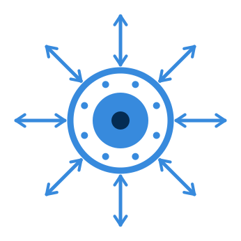

<p align="center">
  
</p>

<h1 align="center">Task Hub</h1>

<p align="center">
  <strong>One place where all your tasks and calendars agree.</strong><br>
  Runs on your own hardware. Your data never leaves it.
</p>

<p align="center">
  <a href="https://github.com/Sparkinman/task-hub/actions/workflows/publish.yml"></a>
  
  
</p>

---

## Syncs with

|  | Tasks | Calendar |  |
| --- | :---: | :---: | --- |
| **Google** | ✓ | ✓ | Tasks and Calendar. Google Tasks keeps only the date, never a time of day — Task Hub holds the time separately so Google cannot erase it |
| **Todoist** | ✓ | — | Projects and tasks. The quickest of the lot to connect — paste a personal API token, no app to register |
| **TickTick** | ✓ | — | Lists and tasks. Its public API does not expose the calendar, and will not return tags |
| **Microsoft** | ✓ | ✓ | To Do and Outlook Calendar. Registering the app needs an Entra ID directory, which a personal account does not have — [the options](docs/microsoft.md) |
| **Apple** | ✓ | ✓ | iCloud Calendar and iCloud task lists, over CalDAV — [one caveat](docs/apple.md) |
| **CalDAV** | ✓ | ✓ | Any other CalDAV server — Nextcloud, Fastmail, Baïkal, Synology, mailbox.org. Give it the address and it discovers the rest. Nothing is lost in either direction |
| **Obsidian** | ✓ | — | Tasks written in your vault. Read-only unless you turn write-back on |
| **Things 3** | ✓ | — | Import only — Things has no supported way to write in. Its endpoint is unpublished and may change without warning |
| **Radicale** | ✓ | ✓ | Built in. The hub everything meets at |

Every one of those has been run against a real account.

**Tasks and calendars both reach your iPhone, iPad and Mac, and appear in
Apple's own Calendar and Reminders apps.** That is the ordinary way to use Task
Hub with Apple devices, it needs no Apple connector at all, and it is verified
working in both directions — create a reminder on the phone and it reaches
Todoist; change it anywhere and it reaches the phone.

The one caveat belongs to the **iCloud connector** rather than to Apple devices:
if an Apple ID's Reminders were ever "upgraded" in Apple's app, the reminders
already in that account moved somewhere no application can reach, and lists
created inside iCloud are not displayed by the Reminders app.
[What that means and how to tell](docs/apple.md). It does not affect calendars,
and it does not affect the route above.

And because the hub is a real CalDAV server, anything that speaks CalDAV joins
without a connector at all:

| App | | |
| --- | --- | --- |
| **Apple Calendar and Reminders** | iPhone, iPad, Mac | Built in, nothing to install |
| **DAVx⁵** | Android | The sync layer; pair it with Tasks.org or your calendar app |
| **Tasks.org** | Android | The Android task app to use. Free on F-Droid; the Play build charges for sync |
| **jtx Board** | Android | Tasks, notes and journals, through DAVx⁵ |
| **Home Assistant** | Anywhere | Task lists become `todo.*` entities your automations can read and write |
| **Thunderbird** | Windows, macOS, Linux | Calendars and tasks both |
| **Super Productivity** | Desktop | Reads your tasks and syncs completion back. It cannot *create* tasks on the server, so treat it as a place to work through them |
| **GNOME Calendar / GNOME To Do** | Linux | |
| **Supernote and other e-ink tablets** | | Anything with a CalDAV client |

[How to connect each of them](docs/third-party-apps.md).

**Vikunja does not fit here**, and it is asked about often enough to be worth
saying: Vikunja is itself a CalDAV *server*, not a client, so it cannot
subscribe to Task Hub. The two do the same job at that layer rather than
complementing each other.

---

## The problem

Your tasks are scattered. Some live in Todoist, some in Google Tasks, a few
written into an Obsidian note at two in the morning, and the appointments they
relate to are in a calendar that knows nothing about any of them.

Every tool that promises to fix this fails the same way, and the reason is
specific: **the services disagree about what a task even is.** Google Tasks
cannot store a time of day. Todoist has four priority levels; iCalendar has
nine; Microsoft To Do has three. TickTick's API will not return the tags you can
plainly see in its own app.

So a naive sync destroys things. It reads a task from Google, sees no time of
day, concludes the time was cleared, and helpfully wipes the 5pm you set in
Todoist. Do that on a schedule and it quietly eats your data — in both
directions, for ever.

## What Task Hub does about it

**Absent is not empty.** Every connector declares exactly what its service can
faithfully hold, and the merge engine only ever considers fields a service
actually claims. Google Tasks never reports a time of day, so nothing coming
from Google can erase one. No special case for Google exists anywhere in the
code; the capability declaration does it, and every service gets the same
treatment.

**Conflicts resolve per field, not per record.** Edit a note in Todoist and a
due date in Google between two syncs and both survive. Whole-record
last-writer-wins would silently discard one, and you would never know which.

**An echo is not an edit.** Services stamp a whole item as modified when one
field changes, so a service reporting back what you sent it looks exactly like
somebody editing it. Task Hub remembers what it last wrote to each service —
including how that service will mangle it, because a four-level priority scale
returns a different number than it was given — so an echo is recognised and
ignored rather than fought.

Everything converges on a **built-in CalDAV server**, which your phone, your
laptop's calendar and any standards-respecting app can talk to directly. Your
tasks end up in Apple Reminders or on an e-ink tablet without those devices
knowing Todoist exists.

## Your data stays yours

Task Hub is a container you run. There is no Task Hub account, no hosted
service, no free tier, and nothing to sign up to — because there is no company
in the middle to sign up to.

- **Everything lives on your hardware.** Tasks, calendars, sync history and
  settings are in a Docker volume on your own machine. Nobody else has a copy,
  and nobody can take it away, change the terms, or shut it down.
- **Nothing is sent anywhere except the services you connect.** No telemetry, no
  analytics, no phoning home, not even a version check. The only outbound
  traffic is to the accounts you asked it to sync, and you can watch every
  request in the sync history.
- **Your service logins are encrypted at rest**, with the key in a separate file
  from the database — copying one without the other yields nothing useful.
- **The CalDAV server is yours too.** Your phone talks to *your* server on your
  network. Your tasks are not routed through anybody's cloud on the way to your
  own pocket, and they keep working if the internet does not.
- **One file backs it all up**, from the web interface, and restores onto a
  different machine just as easily. Leaving is as easy as arriving.
- **The source is all here**, under the GPL, with every dependency pinned. If
  this project stops tomorrow, the image you have keeps running and the code to
  build another is in front of you.

The one caveat worth stating plainly: if you choose to reach it from outside
your network — a Cloudflare tunnel, Tailscale, your own reverse proxy — then
that route is yours to pick and yours to trust. Task Hub does not require any of
them, and on a home network it needs none.

---

## What it is like to run

One container. No configuration file, no environment variables to guess at, no
terminal after the first line. It works out its own address from however you
reach it, so the same image is correct on a Raspberry Pi at
`192.168.1.50:8080`, behind a Cloudflare tunnel, over Tailscale, or behind your
own nginx — and it hands each service the redirect address that actually works,
because it is the one that just delivered the page.

Connecting an account, choosing what syncs, backups, restores, even restarting:
all in the browser. The only thing that ever needs a command line is updating,
because a program cannot replace itself while it is running.

## Honest about what it is not

Some connectors are further along than others, and the difference is stated
everywhere you would see it rather than buried. A connector that has never run
against a real account says so on its own page, in those words, until somebody
connects one — see [what works today](#what-works-today).

It is tested against real accounts rather than mocks, because that is the only
thing that finds real faults: `tests/stress_live.py` drives every connected
service at two hundred tasks and two hundred events, creating throwaway lists in
each, measuring memory, processor time and query counts per pass, and removing
everything it made afterwards.

---

## Install

**Never used Docker? Start here.** Pick your machine — the first three need no
typing at all, and the other two need one line pasted once.

| Your machine | What it takes | |
|---|---|---|
| **Windows** | No terminal. Docker Desktop's own window does all of it. | [Guide](docs/install-windows.md) |
| **Mac** | No terminal. Docker Desktop's own window does all of it. | [Guide](docs/install-macos.md) |
| **NAS** — Synology, QNAP, Unraid, TrueNAS, Asustor | No terminal. Your NAS's own container app does all of it. | [Guide](docs/install-nas.md) |
| **Raspberry Pi** | One pasted line. A Pi has no Docker Desktop, so this is unavoidable. | [Guide](docs/install-raspberry-pi.md) |
| **Linux server or desktop** | One pasted line. | [Guide](docs/install-linux.md) |

On a Pi or a Linux machine, that line is:

```
curl -fsSL https://raw.githubusercontent.com/Sparkinman/task-hub/main/install.sh | sh
```

It checks the machine, installs Docker if it is missing, finds a free port if
8080 is taken, downloads and starts Task Hub, waits for it to come up, and
prints the address to open. Run it again later and it updates Task Hub without
touching your data.

Then open **http://localhost:8080** — or, from another device, this machine's
address on your network with `:8080` after it — and follow the setup wizard.

**After the install, there is no terminal at all.** Connecting Google, Todoist,
TickTick and Obsidian, choosing what syncs, backups, restores and even
restarting are all in the web interface. The single exception is updating,
because a program cannot replace itself while it is running.

Every guide is written for someone who has not done this before, and covers both
a fresh machine and one that already has Docker.

| | |
| --- | --- |
| [How it finds its own address](docs/addresses.md) | What each service accepts, and why sign-in fails when it does |

Already have Docker and would rather do it yourself:

```
mkdir -p ~/taskhub && cd ~/taskhub
curl -fsSL -O https://raw.githubusercontent.com/Sparkinman/task-hub/main/docker-compose.yml
docker compose up -d
```

Not sure whether your machine is up to it? This checks and changes nothing:

```
curl -fsSL https://raw.githubusercontent.com/Sparkinman/task-hub/main/check-system.sh | sh
```

### One image, any address

Most self-hosted software has to be told where it lives, and quietly breaks when
you reach it a different way. Task Hub works its own address out from each
request instead, so the same image is correct on a home network address, behind
a Cloudflare tunnel, over Tailscale, and behind your own nginx — with nothing to
configure and nothing to change when you move it.

Published for both Intel and ARM at
[`sparkinman/task-hub`](https://hub.docker.com/r/sparkinman/task-hub) and
`ghcr.io/sparkinman/task-hub`, built from this repository by GitHub Actions.

---

## What it does

**Two-way sync across services.** A task created, edited or completed anywhere
propagates everywhere else. Each service supports up to ten independent accounts,
and you choose per-list which ones to read from and which to write back to.

**Lossless round-tripping.** Services disagree about what a task is. Google Tasks
cannot store a time of day at all — it keeps the date and discards the time.
Todoist has priorities Google lacks. If a hub naively mirrored whatever each
service reported, editing a task's date in Google would destroy the 2:30pm you
set in Todoist, and the next sync would spread that loss everywhere.

Task Hub stores due dates as **separate date, time and timezone components**, and
each connector declares which fields it can faithfully represent. Fields a
service cannot express are treated as *absent* rather than empty, so they never
overwrite anything. A date-only edit arriving from Google is applied to the date
component alone, and the time survives.

**An echo is not an edit.** Services stamp one modification time on a whole
item, so changing a date in Google marks its note as freshly modified too --
even though the note is just the value Task Hub last sent. Task Hub remembers
what it pushed to each service, field by field, and ignores values a service is
merely echoing back. Without this, a stale copy would routinely overwrite newer
edits made elsewhere.

**A real CalDAV server.** Radicale is embedded in the same container and mounted
at `/radicale`. Your iPhone, Mac, Android phone or Thunderbird can sync with it
directly, and Task Hub itself is just another client of it.

---

## What works today

> **This describes the `latest` image, and only that.** Task Hub has no release
> version yet — `latest` moves whenever a change is pushed, so the image you
> pull today is not necessarily the one described here, and a table written in
> September says nothing about a build from December. Until versioned releases
> exist, treat this as a statement about the project on the day you read it and
> confirm anything you are relying on. Every dependency inside the image is
> pinned to an exact version, so a given build is at least reproducible; what
> is not yet pinned is which build you get.

Task Hub is being built one service at a time, and a service only counts as
finished once it has been run against a real account — not when its code is
written. Every one of them has now passed that point, and this is the honest
state of each.

Which services carry which fields is in [Syncs with](#syncs-with) above; this
is what each has actually been put through, which is a different question.

- **Google, Todoist, TickTick, Obsidian and the built-in Radicale** have all
  been driven against live accounts, including a two-hundred-task,
  two-hundred-event stress run measuring memory, processor time and query counts
  per pass.
- **Apple devices** — iPhone, iPad and Mac — are verified working for both
  tasks and calendars, in both directions, through Apple's own Calendar and
  Reminders apps. No Apple connector is involved: the device talks to Task Hub's
  CalDAV server directly.
- **The iCloud connector** has separately been run against a live account, two
  hundred tasks and two hundred events through a list and a calendar it created
  and removed itself, settling to zero writes. Its one limitation is Apple's:
  reminders already sitting in an "upgraded" Apple ID are unreachable by any
  application, and iCloud task lists are not shown in the Reminders app on such
  an account. Calendars are unaffected.
  [What that means](docs/apple.md).
- **The CalDAV connector** — the same code as iCloud's, pointed anywhere — has
  been run against a live server: sign-in, discovery, and a to-do created, read
  back and deleted with its due time, priority and notes all intact. That was
  against Radicale rather than Nextcloud or Fastmail, so the protocol path is
  proven while those particular servers are not.
- **Microsoft** has been run against a live account and works. Registering the
  app now needs an Entra ID directory, which a personal Microsoft account does
  not have — [the guide covers the options and what each costs](docs/microsoft.md).
- **Things 3** has been run against a live Things Cloud account and imports
  correctly. It reads and never writes, because Cultured Code publishes no way
  to write. Its one standing caveat is not a milestone anybody can clear: the
  endpoint it reads is unpublished, so it can stop working whenever Things
  changes its backend. A failure there marks that one account and every other
  service keeps syncing.

**Things 3 keeps a standing warning that no amount of testing can clear.** Its
endpoint is unpublished, so it can stop working whenever Cultured Code changes
their backend, however well it works today. Connecting a real account did find
four faults at once — a versioned entity name, notes arriving as an object
rather than a string, a sign-in that is a GET with the password in a header, and
a history stream with no reliable list membership — which is the argument for
the label rather than against it.

Apple and Microsoft carried that label until recently, and what removing it took
is worth knowing, because it is the argument for the whole approach: connecting
a real Microsoft account found an OAuth callback that had never worked for
anybody, and a priority scale that provoked six hundred redundant writes on
every second sync pass. Connecting a real iCloud account found a calendar host
that Apple redirects you to and the library refuses to follow, which broke every
sync group the account was mapped into. None of it was reachable from a test
against a mock.

Everything else in the project is finished: the sync engine, the field-level
merge, scheduling, sync groups and history, the embedded CalDAV server, the
task and calendar views, orphan cleanup on disconnect, and backup, restore and
restart from the web interface.

**Running Task Hub needs no terminal.** Once it is installed, everything is
done from its own pages — including taking a backup, restoring one, and
restarting it. The one exception is applying an update, because a container
cannot replace itself: that remains `docker compose pull && docker compose up
-d`, or a single click in Docker Desktop, Portainer or your NAS's own Docker
interface.

---

## How lists map to collections

Each list has one of two roles in a collection, and the difference decides what
lands in it.

**Full member** — tick a collection on that list's row. The list and the
collection then keep each other up to date in both directions, and the list holds
everything the collection holds, whatever service each task came from. This is
what almost every setup wants and it is a single tick.

**Aggregate** — choose the list under another list's *"Also write out to"*. It
then receives only the tasks that came from the list that named it, which is what
makes it useful for gathering several lists somewhere they can be seen and ticked
off together. Completing something there flows back to the original; anything
created there stays there.

Two rules are enforced rather than left as advice. A list may accept write-back
from only one collection, because two would each create their own copy of every
task and then undo one another. And a list synced with a collection through its
own row is never switched off by a save made on another service's page.

---

## Known service limitations

These are limits of the services themselves, verified against their current
APIs. They are surfaced in the interface next to each service rather than
hidden. The three unfinished connectors are included so that the reasons they
are hard are on the record — not as a suggestion to try them.

- **Google Tasks** cannot store a time of day, has no priorities, no tags and no
  location. Its OAuth app must be published to *Production* — in *Testing* mode
  Google expires the login every seven days.
- **TickTick** exposes only tasks and projects to third parties. Its calendar is
  not available at all, it has no webhooks, and its Inbox is unreachable. Its
  listings omit completed tasks entirely, so Task Hub asks about each task that
  disappears rather than reading absence as deletion. Its tokens cannot be
  refreshed, so an expired one needs reconnecting by hand.
- **Todoist** has no calendar, and its 1–4 priority scale runs opposite to
  iCalendar's. Its REST v2 and Sync v9 APIs were retired in early 2026; Task Hub
  uses the unified API v1. Connecting needs nothing more than the personal API
  token from Todoist's own settings — OAuth is offered but not required.
- **Apple Reminders** requires a *second* Apple ID used purely as a task store,
  added to your devices as a manual CalDAV account. Apple's Reminders app moves
  an "upgraded" primary account's lists somewhere CalDAV cannot reach. Apple
  Calendar syncs normally with an app-specific password.
- **Things 3** publishes no API of any kind. Its connector uses a
  community-documented Things Cloud endpoint, which is unofficial and can break
  without warning. Its failures never stall the other services.
- **Obsidian** needs an Obsidian Sync subscription: Sync has no public API, and
  signing in as another device is the only way a server can read a vault. It is
  read-only, enforced by Obsidian's own client rather than by convention. A task
  written on a line holds no time of day; a TaskNotes file does. A plain
  checkbox is never treated as a task.

---

## Tests

Every suite runs without credentials or a network connection, because the merge
rules must be right regardless of which services happen to be connected. They
also run against a throwaway database, so they are safe to run while Task Hub is
syncing real accounts:

```
./run-tests.sh
```

`test_merge` covers the field-level rules directly, and `test_engine` drives the
whole pull/merge/push loop against stub services — one of which mimics Google
Tasks by refusing to store a time of day. `test_forwarded` covers the address
detection above, one case per deployment shape, because a regression there
breaks sign-in for one whole class of user with an error that points elsewhere.

The same suites run on every push, and no image is published unless they pass.

## Architecture

Python 3.12, FastAPI, SQLite, Jinja2 templates, hand-written CSS and vanilla ES
modules. No Node build step and no CDN — every asset is vendored, so the
container works offline and behaves identically on macOS, Windows and Linux.

```
app/
  main.py            FastAPI app; mounts Radicale WSGI at /radicale
  config.py          Paths, runtime config, key bootstrapping
  crypto.py          Fernet encryption for credentials; bcrypt for passwords
  radicale_embed.py  Embedded CalDAV server and htpasswd management
  db/                SQLAlchemy models, session handling, settings store
  services/          iCalendar domain model and the CalDAV client
  connectors/        base.py (the interface + capability declarations),
                     google.py, radicale_local.py
  sync/              merge.py (the field merge), engine.py (orchestration),
                     scheduler.py, ratelimit.py
  web/               Routers: setup, auth, overview, tasks, calendar,
                     radicale admin, services, google setup, sync, settings, docs
  templates/         Jinja2 templates
  static/            CSS design tokens and client-side behaviour
docs/                Setup guides, rendered inside the application
```

**Why one container.** Radicale ships a WSGI application, so it is mounted inside
the FastAPI app rather than run separately. That means one image, one port and
one process to supervise. Task Hub still talks to it over loopback HTTP through
the standard `caldav` library, so Radicale stays swappable for an external server
without touching any sync code.

**Credentials at rest.** OAuth refresh tokens and app-specific passwords are
encrypted with a Fernet key stored in a separate file from the database. Copying
`taskhub.db` without `secret.key` yields nothing useful. Passwords are hashed
with bcrypt, and the same hash format serves both the web login and Radicale's
htpasswd file.

---

## Data and backup

Everything lives in the Docker volume `taskhub-data`: the database, the
encryption key, and all Radicale collections.

`docker compose down` is safe. **`docker compose down -v` erases everything.**

Backup and restore commands are in
[docs/getting-started.md](docs/getting-started.md#backing-up). The backup file
contains the key to every saved credential, so treat it like a password database.

---

## Security notes

- Session cookies are signed and marked `SameSite=Lax`.
- Login failures do not reveal whether the username exists.
- Setup becomes unreachable once completed.
- The `next` parameter on login only accepts local paths, so it cannot be used to
  redirect elsewhere.
- Deleting a collection requires typing its name.
- There is no password reset. Task Hub has no mail server, so a lost password
  means starting over. The wizard says so before you choose one.

Task Hub is designed to be internet-reachable, but put it behind HTTPS before
exposing it — over plain HTTP the login and every task travel in clear text. A
VPN such as Tailscale is the simplest safe option; a reverse proxy with a real
certificate is the other.

---

## Licence

Task Hub is free software under the **GNU General Public License, version 3**.
The full text is in [LICENSE](LICENSE).

In plain terms: you may run it, study it, change it, and pass it on. If you
distribute it, or anything built from it, you must do so under the same licence
and make your source available. That is the part worth knowing before you build
on it — a modified Task Hub cannot be shipped inside a closed product.

**Why the GPL rather than something more permissive.** Task Hub embeds
[Radicale](https://radicale.org/) as its CalDAV server, mounting it inside the
same process rather than talking to a separate one. Radicale is GPLv3, and a
program that incorporates GPLv3 code is itself covered by those terms when it
is distributed. So this is not so much a choice as an accurate description of
what the software already is. It is noted here because it is the kind of thing
that is much cheaper to know now than to discover after building something on
top of it.

The other dependencies are permissive — MIT, BSD and Apache — and impose no
such requirement. `caldav` is dual-licensed and is used under Apache 2.0.

Copyright © 2026 Sparkinman.
